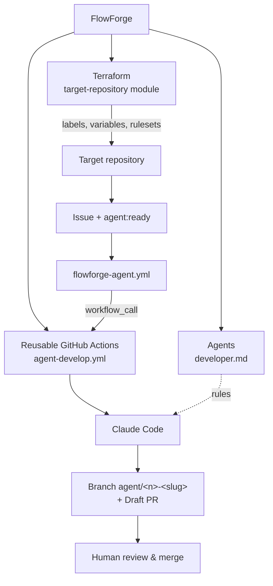

# 🔥 FlowForge

> **Status: experimental — Phase 1 (foundation).** Nothing here is production-ready, and
> no GitHub resource is created or modified yet.

FlowForge is a **central repository** that orchestrates AI-assisted software development
across several GitHub repositories: it configures them declaratively and provides the
workflows and agent rules that turn a well-written Issue into a Draft Pull Request.

------

## 📖 The problem

Using a coding agent on one repository is easy. Using it on **many** repositories leads to:

- copies of the same workflows, prompts and rules drifting apart in every repo;
- hand-configured labels, permissions and branch protections, different in each repo;
- no single place to improve the agent's behavior or tighten its permissions.

## 🎯 The approach: 1 FlowForge → N target repositories

| FlowForge owns (once) | Each target repository owns |
|---|---|
| Terraform module to onboard a repo | Its code and tests |
| Reusable GitHub Actions workflows | Its CI |
| Generic agent rules (`agents/`) | Its `CLAUDE.md` (project conventions) |
| | A ~20-line `flowforge-agent.yml` calling FlowForge |

------

## 🏗️ Architecture



Details: [docs/architecture.md](docs/architecture.md).

------

## 🔀 Target workflow: Issue → Draft PR

```text
GitHub Issue → label agent:ready → target workflow → FlowForge reusable workflow
→ Claude Code → branch agent/<issue>-<slug> → code + tests → Draft PR → human validation
```

The agent never pushes to `main` and never merges. See [agents/developer.md](agents/developer.md).

------

## 🚀 Phase 1

Goal: make the flow above work end to end on one POC repository, `demo-api`
(FastAPI + pytest), with the Issue *"Add GET /health"*.

Current step: **1 — FlowForge initialized**. Next: create `demo-api`. Full plan:
[docs/phase-1.md](docs/phase-1.md).

Later phases (not started): Refiner, Reviewer, Iterator agents, GitHub Project, Notion.

------

## 🛠️ Stack

| Area | Tool |
|---|---|
| GitHub configuration | Terraform + [`integrations/github`](https://registry.terraform.io/providers/integrations/github/latest) provider |
| Orchestration | GitHub Actions reusable workflows (`workflow_call`) |
| Agent runtime | Claude Code (integration: Phase 1, step 5) |
| Quality | pre-commit, `terraform fmt` / `validate` |

------

## 📁 Layout

```text
.github/workflows/agent-develop.yml   reusable Developer workflow (called by targets)
.github/ISSUE_TEMPLATE/feature.yml    agent-friendly issue form
agents/developer.md                   generic Developer agent rules
examples/target-repository/           caller workflow to copy into a target
terraform/                            root config + target-repository module
docs/                                 architecture and phase plans
scripts/                              maintainer helpers (empty for now)
```

------

## ✅ Local checks

```bash
pre-commit install            # once
pre-commit run --all-files    # whitespace, EOF, YAML, JSON, private keys, terraform fmt/validate
```

## 🔐 Security

No token or secret is ever committed; Terraform reads `GITHUB_TOKEN` from the environment;
workflows use minimal permissions; agents only open Draft PRs. See
[docs/architecture.md §4](docs/architecture.md#4--security-model).

## 📄 License

[MIT](LICENSE)
