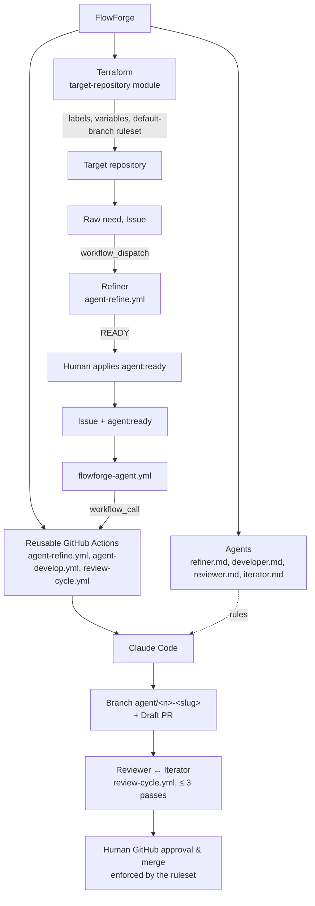

# 🔥 FlowForge

> **Status: experimental — Phase 4 (Iterator) validated end to end, with reservations ([milestone](docs/milestones/phase4-iterator-e2e.md)); Phase 4.1 (hardening & lifecycle) validated end to end and frozen, with one reservation ([milestone](docs/milestones/phase41-hardening-e2e.md)). Phase 5 (Refiner) validated end to end and frozen, with reservations ([milestone](docs/milestones/phase5-refiner-e2e.md)). Next: Phase 6 — GitHub Projects / Kanban (not started).** Nothing here is production-ready.

FlowForge is a **central repository** that orchestrates AI-assisted software development
across several GitHub repositories: it configures them declaratively and provides the
workflows and agent rules that turn a raw need into a refined Issue, then into a Draft Pull
Request that a human merges.

------

## 📖 The problem

Using a coding agent on one repository is easy. Using it on **many** repositories leads to:

- copies of the same workflows, prompts and rules drifting apart in every repo;
- hand-configured labels, permissions and branch protections, different in each repo;
- no single place to improve the agent's behavior or tighten its permissions.

## 🎯 The approach: 1 FlowForge → N target repositories

| FlowForge owns (once) | Each target repository owns |
|---|---|
| Terraform module to onboard a repo | Its code and tests |
| Reusable GitHub Actions workflows | Its CI |
| Generic agent rules (`agents/`) | Its `CLAUDE.md` (project conventions) |
| | A ~20-line `flowforge-agent.yml` calling FlowForge |

------

## 🏗️ Architecture



Details: [docs/architecture.md](docs/architecture.md).

------

## 🔀 Target workflow: Issue → Draft PR

```text
GitHub Issue → label agent:ready → target workflow → FlowForge reusable workflow
→ Claude Code → branch agent/<issue>-<slug> → code + tests → Draft PR → human validation
```

The agent never pushes to `main` and never merges. See [agents/developer.md](agents/developer.md).

Phase 3 adds a **Reviewer** between the Draft PR and the human review. It is defined in
[agents/reviewer.md](agents/reviewer.md) and run by the reusable workflow
`agent-review.yml`; its first end-to-end run on `demo-api` is validated
([milestone](docs/milestones/phase3-reviewer-e2e.md)):

```text
Issue → Developer → Draft PR → Reviewer → APPROVE | REQUEST_CHANGES | BLOCKED → human review
```

The Reviewer is read-only: it produces structured findings and a verdict (one PR comment +
a JSON artifact), never commits nor merges.

Phase 4 defines an **Iterator** ([agents/iterator.md](agents/iterator.md)) that fixes the
findings of a `REQUEST_CHANGES` review on the existing PR branch, then hands the PR back to
the Reviewer, in a loop bounded to 3 iterations. One iteration is run by the reusable
workflow `agent-iterate.yml`; the loop is orchestrated by `review-cycle.yml`, which only
decides who runs and when:

```text
Issue → Developer → Draft PR → Reviewer → REQUEST_CHANGES → Iterator → Reviewer → …
        stops on APPROVE, BLOCKED, or after 3 Iterator passes (MAX_ITERATIONS_REACHED)
```

The cycle never merges, never marks the PR ready for review: the final merge stays human.

------

## 🛡️ Human merge gate

The last step is a **human** decision, enforced by GitHub, not only by convention. The
Terraform module puts a ruleset on the target's default branch: pull request required, at
least one GitHub approval, approvals dismissed by new pushes, no force push, no deletion, no
bypass for FlowForge.

```text
Reviewer APPROVE → cycle APPROVED → PR still Draft and unmerged
→ human: Ready for review → GitHub approval → merge → agent:done
```

A Reviewer `APPROVE` is an agent verdict posted as a PR comment; it is **not** a GitHub
approval and does not count for the ruleset. Agent PRs are authored by `github-actions[bot]`,
which cannot approve its own PRs; no FlowForge workflow approves, merges or enables
auto-merge. Details: [docs/architecture.md §2.7](docs/architecture.md#27-human-merge-gate-phase-41).

------

## 🚀 Roadmap

Phase 1 goal: make the flow above work end to end on one POC repository, `demo-api`
(FastAPI + pytest), with the Issue *"Add GET /health"*. Plan: [docs/phase-1.md](docs/phase-1.md).

| Phase | Status |
|---|---|
| Phase 1 — Foundation | ✅ Done |
| Phase 2 — Developer E2E | ✅ Done — tag `flowforge-phase2-e2e` |
| Phase 3 — Reviewer | ✅ Done — tag `flowforge-phase3-reviewer-e2e` ([milestone](docs/milestones/phase3-reviewer-e2e.md)) |
| Phase 4 — Iterator | ✅ Done, with reservations — tag `flowforge-phase4-iterator-e2e` ([milestone](docs/milestones/phase4-iterator-e2e.md)) |
| Phase 4.1 — Hardening & lifecycle | ✅ Done, validated E2E, one reservation — tag `flowforge-phase4.1-hardening-e2e` ([milestone](docs/milestones/phase41-hardening-e2e.md)) |
| Phase 5 — Refiner agent | ✅ Done, validated E2E, with reservations — tag `flowforge-phase5-refiner-e2e` ([milestone](docs/milestones/phase5-refiner-e2e.md)) |
| Phase 6 — GitHub Projects / Kanban | ⏭️ Next, not started |

Phase 4.1 covers: Iterator partial delivery (#17), closed / merged PR = `NO_OP` (#18), Issue
label lifecycle up to `agent:done` (#19), and the human merge gate (default-branch ruleset).
Each is covered by offline tests and was validated live on `demo-api` on 2026-10-09.

**Phase 5 — Refiner (done)**: turn a rough human need into a
structured, executable Issue that the existing chain consumes. Started on demand
(`gh workflow run flowforge-refine.yml -f issue_number=<n>` in the target); verdict `READY`,
`NEEDS_CLARIFICATION` (label `agent:needs-clarification`) or `BLOCKED`. A human still applies
`agent:ready`:

```text
rough human need → Refiner → structured Issue → Developer → Reviewer ⇄ Iterator → human
```

Refiner validated in isolation (Prompt 23, [milestone](docs/milestones/phase5-refiner-simple-cases.md))
and end to end in the chain (Prompt 24, [milestone](docs/milestones/phase5-refiner-e2e.md)), then
closed with reservations (Prompt 25, same milestone §13). The Refiner is optional: a hand-written
`agent:ready` Issue still goes straight to the Developer.

**Phase 6 — GitHub Projects / Kanban (next, not implemented)**: a backlog and a Kanban view of
the Issues FlowForge drives, with Project statuses kept in sync with the `agent:*` state
transitions. **Future (not implemented)**: Notion, QA agent, Documentation agent, self-hosted
runners.

------

## 🛠️ Stack

| Area | Tool |
|---|---|
| GitHub configuration | Terraform + [`integrations/github`](https://registry.terraform.io/providers/integrations/github/latest) provider |
| Orchestration | GitHub Actions reusable workflows (`workflow_call`) |
| Agent runtime | Claude Code via [`anthropics/claude-code-action`](https://github.com/anthropics/claude-code-action) (automation mode) |
| Quality | pre-commit, `terraform fmt` / `validate` |

------

## 📁 Layout

```text
.github/workflows/agent-develop.yml   reusable Developer workflow (called by targets)
.github/workflows/agent-review.yml    reusable Reviewer workflow (called by targets)
.github/workflows/agent-iterate.yml   reusable Iterator workflow (one iteration per call)
.github/workflows/review-cycle.yml    reusable bounded Reviewer ↔ Iterator loop (≤ 3 Iterator passes)
.github/workflows/agent-lifecycle.yml reusable lifecycle workflow (Issue terminal state on PR close)
.github/workflows/agent-refine.yml    reusable Refiner workflow (refines one Issue, read-only agent)
.github/scripts/flowforge-state.sh    agent:* state label transitions (one state per Issue)
.github/scripts/flowforge-refine.sh   Refiner result validation and refined body rendering
.github/ISSUE_TEMPLATE/feature.yml    agent-friendly issue form
agents/developer.md                   generic Developer agent rules
agents/reviewer.md                    generic Reviewer agent rules
agents/iterator.md                    generic Iterator agent rules
agents/refiner.md                     generic Refiner agent rules (Phase 5)
examples/target-repository/           caller workflows to copy into a target
terraform/                            root config + target-repository module (labels, ruleset…)
docs/                                 architecture, refined Issue contract, phase plans, milestones
scripts/                              maintainer helpers (empty for now)
```

------

## ✅ Local checks

```bash
pre-commit install            # once
pre-commit run --all-files    # whitespace, EOF, YAML, JSON, private keys, terraform fmt/validate, actionlint
```

The same hooks run in CI (`.github/workflows/ci.yml`) on every pull
request and on pushes to `main`.

## 🔐 Security

No token or secret is ever committed; Terraform reads `GITHUB_TOKEN` from the environment;
workflows use minimal permissions; agents only open Draft PRs, and a default-branch ruleset
requires a human approval to merge. See
[docs/architecture.md §4](docs/architecture.md#4--security-model).

## 💡 Inspiration

FlowForge is inspired by [big-emotion/ferry](https://github.com/big-emotion/ferry), a
GitHub Actions–native agent pipeline that turns Jira column moves into reviewed draft PRs,
with no server and no daemon.

Ideas borrowed from ferry: the split into specialized agents (Refiner, Developer, Reviewer,
Iterator) and the rule that agents open Draft PRs but never merge. FlowForge reimplements them
independently on GitHub Issues: a label (`agent:ready`) replaces the Jira column move, and one
central repository serves several target repositories through reusable workflows. No ferry
code is included.

## 📄 License

[MIT](LICENSE)
