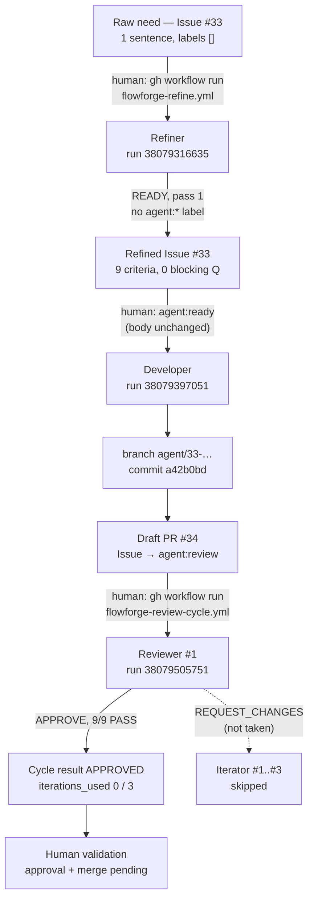

# 🔗 Milestone — Phase 5: Refiner validated end to end in the FlowForge chain

> **Date**: 2026-10-10 (UTC)
> **Status**: ✅ Validated (Prompt 24). One raw need went through Refiner → `READY` → Developer →
> Draft PR → Reviewer `APPROVE` with **no** manual change to the need. The only human action was
> applying `agent:ready`. The Iterator was **not needed** (first review `APPROVE`). The human merge
> is still pending and stays a human decision. Reservations are in §10.

------

## 🧠 Mental Model

```text
  raw need (1 sentence, FR)       Issue #33
          │  gh workflow run flowforge-refine.yml        run 38079316635   (Refiner, read-only)
          ▼
  refined body, verdict READY     title rewritten, 9 criteria, no agent:* label
          │  human: agent:ready   (administrative, body unchanged: same sha256)
          ▼
  Developer                       run 38079397051 → branch agent/33-… → a42b0bd → Draft PR #34
          │  gh workflow run flowforge-review-cycle.yml
          ▼
  Reviewer #1                     run 38079505751 → APPROVE, 9/9 Refiner criteria PASS
          │  Iterator #1..#3 skipped (iterations_used 0 / 3)
          ▼
  human validation                PR #34 open, Draft, not merged — Issue #33 agent:review
```

------

## 1. 🎯 Objective

Check that an Issue **produced by the Refiner** can be used as is by the Developer, the Reviewer
and, if needed, the Iterator, with no manual rewrite of the need. Boundary:
`raw need → Refiner → READY → Developer → Draft PR → Reviewer ⇄ Iterator → human validation`.
No new agent, no orchestrator, no automatic chaining, no merge.

## 2. 🏗️ Environment and pre-flight audit

| Item | Value |
|---|---|
| FlowForge | `7054a3eb553222f0c0bf0978723bb9b51456d4a7` (`main`): `referenced_workflows` of the 3 runs and `rules_sha` of the refinement record |
| FlowForge checks | `tests/*.sh` (5 scripts) pass locally; CI on `main` green |
| Target | `TiPunchLabs/demo-api`, `main` at `7a5be0d`, **unchanged** before/after |
| Callers (`@main`) | `flowforge-refine.yml` (`workflow_dispatch`), `flowforge-agent.yml` (`issues: labeled` + `agent:ready`), `flowforge-review-cycle.yml` (`workflow_dispatch`, `max_iterations: 3`) |
| Labels | the 6 `agent:*` labels from the Terraform module exist |
| Secret | `CLAUDE_CODE_OAUTH_TOKEN` visible to the repository |
| Before the run | 0 open PR, 1 branch (`main`), 18 PRs in total. Open Prompt 23 Issues #28, #30, #31 were **not** reused; the new need does not overlap them |
| Coupling check | `agent-develop.yml`, `agent-review.yml`, `agent-iterate.yml`, `review-cycle.yml` and `agents/{developer,reviewer,iterator}.md` contain no reference to the Refiner, its markers or `agent:needs-clarification` (§8) |

## 3. 📝 Scenario: raw need

A real code change, absent from `demo-api` (`GET /tasks` filters only on `completed`), and
deliberately unstructured: one sentence, no criteria, no parameter name, no error behaviour.

Issue [#33](https://github.com/TiPunchLabs/demo-api/issues/33), created 2026-10-10T19:19:02Z by
@xgueret, `OPEN`, labels `[]`:

> **[FlowForge E2E P24] Filtrer les tâches par priorité**
>
> Ce serait pratique de pouvoir filtrer les tâches par priorité quand on les liste.
>
> _(Test E2E FlowForge Phase 5 — Prompt 24 : besoin brut volontairement non structuré.)_

## 4. 🧭 Refiner

Run [38079316635](https://github.com/TiPunchLabs/demo-api/actions/runs/38079316635): `refine` ✅,
`publish` ✅, 5 turns, $0.13. Verdict **`READY`** at the first pass, so no clarification round.

Refined Issue at `READY` (title `feat: filter tasks by priority on GET /tasks`, labels `[]`, body
sha256 `b597d745…6c01c`):

- **Context**: the need is `[provided]`; the existing `completed` filter, pagination and the
  `Priority` literal are `[observed]` with file references; the parameter name and the multi-value
  behaviour are `[missing]`.
- **Scope**: an optional `priority` query parameter on `list_tasks`, typed with `Priority`, combined
  with `completed`, before pagination; tests; README `## API`.
- **Out of scope**: several priorities at once, sorting by priority, other filters, schema/storage
  changes, any change to `completed` / `limit` / `offset`.
- **Constraints**: 5, all `[observed]` (`completed` pattern, `Priority` reuse, type hints and
  docstrings, README, no new dependency).
- **Open questions**: 0 blocking, 2 non-blocking with defaults (name `priority`, single value;
  filter in the route).
- **Assumptions**: 2 (exact match on one value; 422 on invalid values via the literal).
- *Original request* kept verbatim, *Refinement record* entry 1, one FlowForge comment.

**Non-invention check.** The raw sentence fixes no behaviour, and the Refiner presents none as a
requirement: 8 criteria are `[recommended]`, 1 is `[observed]` (the `CLAUDE.md` check commands).
The FlowForge comment states that applying `agent:ready` accepts the `[recommended]` items. Every
recommendation follows a repository pattern (`completed` filter, `Priority`, FastAPI 422).

Acceptance criteria produced by the Refiner (numbered for §7):

| # | Criterion | Tag |
|---|---|---|
| C1 | `GET /tasks?priority=high` → 200, only `high` tasks, still sorted by id | recommended |
| C2 | Same for `low` and `medium` | recommended |
| C3 | Without `priority`, `GET /tasks` behaves exactly as before | recommended |
| C4 | `priority` combines with `completed` (`high` + `completed=false` → pending high only) | recommended |
| C5 | Filter applied before `limit`/`offset` pagination | recommended |
| C6 | `priority=urgent` → 422 | recommended |
| C7 | No task with that priority → 200, `[]` | recommended |
| C8 | New pytest tests cover success and 422 cases, with the `client` fixture | recommended |
| C9 | `uv run pytest`, `ruff check .`, `ruff format --check .` pass | observed |

## 5. 🛠️ Developer

| Item | Value |
|---|---|
| Trigger | human applies `agent:ready` on #33 (2026-10-10T19:20:17Z) |
| Run | [38079397051](https://github.com/TiPunchLabs/demo-api/actions/runs/38079397051): `develop` ✅, 16 turns, $0.19 |
| Branch | `agent/33-feat-filter-tasks-by-priority-on-get-tas` |
| Commit | `a42b0bdf15928edf4960b98c7c6ee44d6b4d0ad2` `feat: filter tasks by priority on GET /tasks` (1 commit) |
| Draft PR | [#34](https://github.com/TiPunchLabs/demo-api/pull/34), `Closes #33`, Draft |
| Diff | `src/demo_api/routes/tasks.py` +5 −2, `tests/test_tasks.py` +63 −1, `README.md` +2 −1 |
| Tests (agent) | `uv run pytest` 68 passed; `ruff check` and `ruff format --check` pass |

The diff follows the Refiner's scope and notes: `priority: Priority | None = None` next to
`completed`, filtered before the slice, 7 new test cases, README table and sentence updated. No
file outside the scope; no schema, storage or other-endpoint change. The Issue body was not
touched between `READY` and the Developer run: same sha256 after the run.

## 6. 🔍 Reviewer and Iterator

| Item | Value |
|---|---|
| Trigger | `gh workflow run flowforge-review-cycle.yml -R TiPunchLabs/demo-api -f pull_request_number=34` |
| Run | [38079505751](https://github.com/TiPunchLabs/demo-api/actions/runs/38079505751) ✅, Reviewer #1: 4 turns, $0.15 |
| Reviewed commit | `a42b0bd` |
| Verdict | **`APPROVE`**, 0 BLOCKER / 0 MAJOR / 0 MINOR / 0 NOTE |
| Cycle result | `cycle.json`: `result: APPROVED`, `iterations_used: 0`, `max_iterations: 3` |
| Iterator | Iterator #1–#3 and Reviewer #2–#4 `skipped`: **not needed**. Its compatibility with a refined body is not exercised by this run (§10) |

The Reviewer's *Acceptance Criteria* section lists exactly the 9 Refiner criteria, in order, each
with evidence (test name, expected ids, local command output). It used the refined Issue as its
reference, with no extra prompt. It ran the checks itself because PR CI was `action_required`
(`GITHUB_TOKEN` PR, known behaviour).

## 7. ✅ Refiner criteria vs result

| # | Implemented | Verified | Evidence |
|---|---|---|---|
| C1 | ✅ | ✅ | filter after the id sort; `test_list_filters_priority[high]` → `[1, 3, 5]` |
| C2 | ✅ | ✅ | same test, `low` → `[2]`, `medium` → `[4]` |
| C3 | ✅ | ✅ | filter skipped when `None`; `test_list_without_priority_returns_all`; existing tests pass |
| C4 | ✅ | ✅ | `test_list_priority_combines_with_completed` → `[3, 5]` |
| C5 | ✅ | ✅ | filter before the slice; `test_list_priority_applies_before_pagination` → `[3]` |
| C6 | ✅ | ✅ | `Priority` literal; `{"priority": "urgent"}` added to `test_list_rejects_invalid_query` |
| C7 | ✅ | ✅ | `test_list_priority_without_match_returns_empty` |
| C8 | ✅ | ✅ | all new tests take `client` |
| C9 | ✅ | ✅ | Developer and Reviewer runs: 68 passed, ruff clean |

No criterion was misread. No failure needs a cause attribution.

## 8. 🏷️ Labels, state and traceability

Issue #33 timeline (GitHub API):

```text
19:19:02  created by xgueret                  labels []
19:20:02  renamed by github-actions[bot]      Refiner publish (title + body)
19:20:04  comment by github-actions[bot]      FlowForge Refinement, READY
19:20:17  labeled agent:ready  by xgueret     ← only human action
19:20:29  agent:ready → agent:running         Developer (state helper)
19:21:24  cross-referenced by PR #34
19:21:29  agent:running → agent:review        Draft PR opened
          (review cycle APPROVED: no label change, by design)
now       agent:review, OPEN                  waiting for the human merge → agent:done
```

At most one `agent:*` label at every step; no leftover `agent:ready` or
`agent:needs-clarification`. Only labels that exist were used; no GitHub Project state is
claimed.

Each link of the chain points to the next one:

| Element | Reference |
|---|---|
| Raw need | *Original request* block in #33 (verbatim) |
| Refiner run | refinement record + FlowForge comment → run 38079316635, rules `7054a3e` |
| Refined Issue | #33 body, sha256 `b597d745…6c01c` |
| Developer run | run 38079397051 (`issues: labeled`, actor xgueret) |
| Branch / commit | `agent/33-…`, `a42b0bd` |
| Draft PR | #34, `Closes #33` |
| Reviewer run | review comment → run 38079505751, reviewed commit `a42b0bd` |
| Iterator | none (`iterations_used: 0`) |
| Artifacts | `flowforge-refine-issue-33`, `flowforge-review-pr-34`, `flowforge-review-cycle-pr-34` |

**Decoupling.** The Refiner adds no precondition downstream: the Developer reads the Issue body
only, and nothing in the Developer, Reviewer or Iterator mentions the Refiner, its markers or
`agent:needs-clarification` (grep, §2). Developer runs on unrefined `agent:ready` Issues were
validated in Phases 2–4.1 on the same callers, and a refined body is plain markdown. A
hand-written `READY` Issue still goes straight to the Developer; this was checked by reading the
code, not by a new run.

## 9. 🔐 Security

| Check | Result |
|---|---|
| `refine` token (Claude) | `Contents: read`, `Issues: read`, `PullRequests: read`, `Metadata: read` |
| `publish` token | `Issues: write`, `Metadata: read` |
| `develop` token | `Contents: write`, `Issues: write`, `PullRequests: write`, `Metadata: read`; push limited to `git push origin HEAD:refs/heads/agent/33-…` |
| Reviewer token | review job read-only (`Contents`, `Issues`, `PullRequests`, `Checks`, `Statuses`: read); publish job `PullRequests: write` only |
| Secrets in logs (3 runs, all jobs) | 0 credential-like string (`sk-ant-`, `gh[pso]_`); secrets only as `***` |
| `##[error]` | 0 |
| Force push | none: the only `+refs/` hits are `actions/checkout` fetch refspecs; repository events show no forced push |
| Merge | none: PR #34 `OPEN`, Draft |
| `main` | `7a5be0d` before and after; branches: `main` + the agent branch only |

## 10. ⚠️ Interventions, reservations and limitations

**Human interventions**

| Action | Kind |
|---|---|
| Create Issue #33 with the raw need | scenario input |
| `gh workflow run flowforge-refine.yml -f issue_number=33` | administrative (manual trigger by design) |
| Read the `READY` body, then apply `agent:ready` | administrative (human gate by design) |
| `gh workflow run flowforge-review-cycle.yml -f pull_request_number=34` | administrative (manual trigger by design) |

**No functional change** to the need between the Refiner and the Developer: body sha256 identical
before and after the Developer run, no comment added by a human.

**Reservations**

1. **Iterator not exercised on a refined body.** Reviewer #1 approved, so the Iterator did not
   run. This is a valid outcome, but the Iterator's reading of a refined Issue stays
   unproven. Its behaviour on Developer PRs was validated in Phase 4 and does not depend on the
   body format.
2. **Human merge pending.** PR #34 is waiting for a human approval and merge (ruleset §2.7). Then
   `agent-lifecycle.yml` should set `agent:done` on #33. Not observed here.
3. **Proposed label not in the repository.** The Refiner proposed `type:feature`, which does not
   exist on `demo-api`. Harmless (proposals are never applied), but a later rule could limit
   *Proposed labels* to existing labels.
4. **One scenario, `READY` at the first pass.** The `NEEDS_CLARIFICATION` → answer → `READY` path,
   followed by the Developer, was not exercised end to end.
5. **Decoupling checked statically** (§8), not by a new run.

**Incidents and corrections**: none. No FlowForge file other than documentation changed.

**Cost**: Refiner $0.13 + Developer $0.19 + Reviewer $0.15 ≈ $0.47.

## 11. 🗺️ Run actually executed



## 12. ✅ Acceptance criteria (Prompt 24)

| Criterion | Status |
|---|---|
| A real raw need was the starting point | PASS (#33) |
| The need was not already structured | PASS (1 sentence) |
| The Refiner really ran | PASS (38079316635) |
| The Issue reached `READY` | PASS |
| The refined Issue has usable acceptance criteria | PASS (9, all verified) |
| No manual functional addition between Refiner and Developer | PASS (sha256 unchanged) |
| The Developer consumed the refined Issue | PASS |
| The Developer made a real change in the target | PASS (`a42b0bd`) |
| The matching tests ran | PASS (68 passed, Developer and Reviewer) |
| A real Draft PR was created | PASS (#34) |
| The Reviewer really analysed the PR | PASS (38079505751) |
| The Reviewer used the refined Issue's criteria | PASS (9/9 listed) |
| If `REQUEST_CHANGES`, the Iterator ran normally | PASS (not applicable: `APPROVE`) |
| If the Iterator ran, the bound held | PASS (not applicable: 0 / 3) |
| No agent merged | PASS |
| `main` not modified directly | PASS (`7a5be0d`) |
| No force push | PASS |
| No secret exposed | PASS |
| Main transitions traceable | PASS (§8) |
| Real URLs / runs / SHAs documented | PASS |
| Refiner not mandatory for existing `READY` Issues | PASS (static check, §8) |
| Compatible with a future GitHub Projects phase | PASS: state still carried by the single `agent:*` label (contract §6 mapping) |
| Compatible with a future Notion integration | PASS: the Refiner input is an Issue body, so a source only has to produce one (contract §8) |

------

> **Document created on**: 2026-10-10
> **Author**: xgueret, with Claude Code
> **Version**: 1.0
