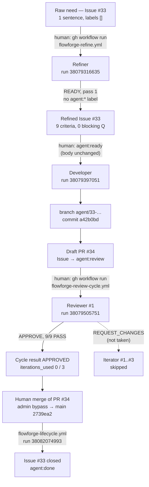
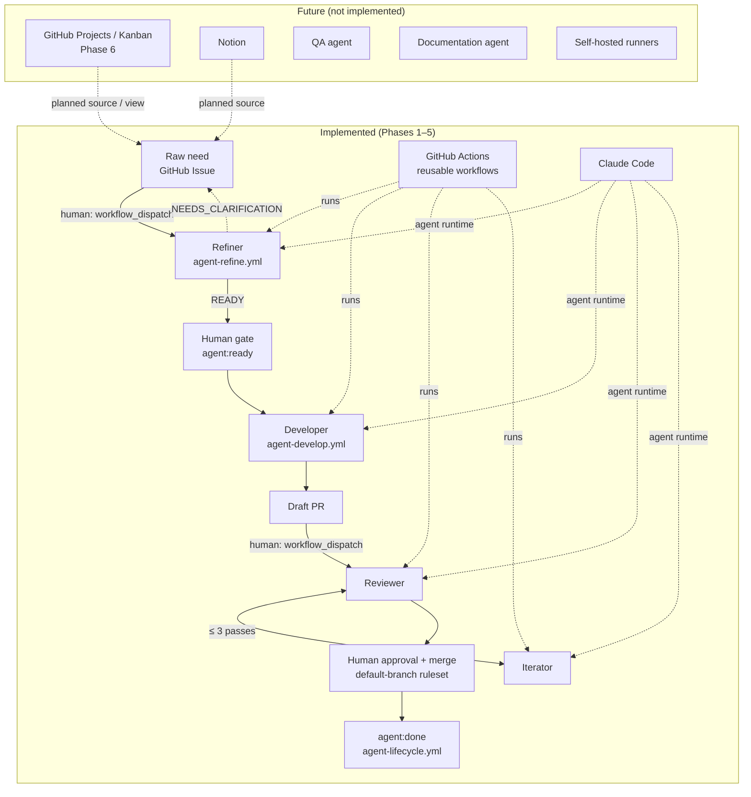

# 🔗 Milestone — Phase 5: Refiner validated end to end in the FlowForge chain

> **Date**: 2026-10-10 (UTC)
> **Status**: ✅ Validated (Prompt 24). One raw need went through Refiner → `READY` → Developer →
> Draft PR → Reviewer `APPROVE` with **no** manual change to the need. The only human action was
> applying `agent:ready`. The Iterator was **not needed** (first review `APPROVE`). A human merged
> PR #34 (admin bypass), and the lifecycle set `agent:done` on #33 (§8). Reservations are in §10.
>
> **Phase 5 closed** (Prompt 25, 2026-10-10): **validated with reservations**, frozen as tag
> `flowforge-phase5-refiner-e2e` in FlowForge and `demo-api`. Closure audit, consolidated
> reservations and Git references in §13.

------

## 🧠 Mental Model

```text
  raw need (1 sentence, FR)       Issue #33
          │  gh workflow run flowforge-refine.yml        run 38079316635   (Refiner, read-only)
          ▼
  refined body, verdict READY     title rewritten, 9 criteria, no agent:* label
          │  human: agent:ready   (administrative, body unchanged: same sha256)
          ▼
  Developer                       run 38079397051 → branch agent/33-… → a42b0bd → Draft PR #34
          │  gh workflow run flowforge-review-cycle.yml
          ▼
  Reviewer #1                     run 38079505751 → APPROVE, 9/9 Refiner criteria PASS
          │  Iterator #1..#3 skipped (iterations_used 0 / 3)
          ▼
  human validation                PR #34 merged by a human (admin bypass) → main 2739ea2
          │  flowforge-lifecycle.yml                     run 38082074993
          ▼
  Issue #33 closed, agent:done
```

------

## 1. 🎯 Objective

Check that an Issue **produced by the Refiner** can be used as is by the Developer, the Reviewer
and, if needed, the Iterator, with no manual rewrite of the need. Boundary:
`raw need → Refiner → READY → Developer → Draft PR → Reviewer ⇄ Iterator → human validation`.
No new agent, no orchestrator, no automatic chaining, no merge.

## 2. 🏗️ Environment and pre-flight audit

| Item | Value |
|---|---|
| FlowForge | `7054a3eb553222f0c0bf0978723bb9b51456d4a7` (`main`): `referenced_workflows` of the 3 runs and `rules_sha` of the refinement record |
| FlowForge checks | `tests/*.sh` (5 scripts) pass locally; CI on `main` green |
| Target | `TiPunchLabs/demo-api`, `main` at `7a5be0d`, **unchanged** before/after |
| Callers (`@main`) | `flowforge-refine.yml` (`workflow_dispatch`), `flowforge-agent.yml` (`issues: labeled` + `agent:ready`), `flowforge-review-cycle.yml` (`workflow_dispatch`, `max_iterations: 3`) |
| Labels | the 6 `agent:*` labels from the Terraform module exist |
| Secret | `CLAUDE_CODE_OAUTH_TOKEN` visible to the repository |
| Before the run | 0 open PR, 1 branch (`main`), 18 PRs in total. Open Prompt 23 Issues #28, #30, #31 were **not** reused; the new need does not overlap them |
| Coupling check | `agent-develop.yml`, `agent-review.yml`, `agent-iterate.yml`, `review-cycle.yml` and `agents/{developer,reviewer,iterator}.md` contain no reference to the Refiner, its markers or `agent:needs-clarification` (§8) |

## 3. 📝 Scenario: raw need

A real code change, absent from `demo-api` (`GET /tasks` filters only on `completed`), and
deliberately unstructured: one sentence, no criteria, no parameter name, no error behaviour.

Issue [#33](https://github.com/TiPunchLabs/demo-api/issues/33), created 2026-10-10T19:19:02Z by
@xgueret, `OPEN`, labels `[]`:

> **[FlowForge E2E P24] Filtrer les tâches par priorité**
>
> Ce serait pratique de pouvoir filtrer les tâches par priorité quand on les liste.
>
> _(Test E2E FlowForge Phase 5 — Prompt 24 : besoin brut volontairement non structuré.)_

## 4. 🧭 Refiner

Run [38079316635](https://github.com/TiPunchLabs/demo-api/actions/runs/38079316635): `refine` ✅,
`publish` ✅, 5 turns, $0.13. Verdict **`READY`** at the first pass, so no clarification round.

Refined Issue at `READY` (title `feat: filter tasks by priority on GET /tasks`, labels `[]`, body
sha256 `b597d745…6c01c`):

- **Context**: the need is `[provided]`; the existing `completed` filter, pagination and the
  `Priority` literal are `[observed]` with file references; the parameter name and the multi-value
  behaviour are `[missing]`.
- **Scope**: an optional `priority` query parameter on `list_tasks`, typed with `Priority`, combined
  with `completed`, before pagination; tests; README `## API`.
- **Out of scope**: several priorities at once, sorting by priority, other filters, schema/storage
  changes, any change to `completed` / `limit` / `offset`.
- **Constraints**: 5, all `[observed]` (`completed` pattern, `Priority` reuse, type hints and
  docstrings, README, no new dependency).
- **Open questions**: 0 blocking, 2 non-blocking with defaults (name `priority`, single value;
  filter in the route).
- **Assumptions**: 2 (exact match on one value; 422 on invalid values via the literal).
- *Original request* kept verbatim, *Refinement record* entry 1, one FlowForge comment.

**Non-invention check.** The raw sentence fixes no behaviour, and the Refiner presents none as a
requirement: 8 criteria are `[recommended]`, 1 is `[observed]` (the `CLAUDE.md` check commands).
The FlowForge comment states that applying `agent:ready` accepts the `[recommended]` items. Every
recommendation follows a repository pattern (`completed` filter, `Priority`, FastAPI 422).

Acceptance criteria produced by the Refiner (numbered for §7):

| # | Criterion | Tag |
|---|---|---|
| C1 | `GET /tasks?priority=high` → 200, only `high` tasks, still sorted by id | recommended |
| C2 | Same for `low` and `medium` | recommended |
| C3 | Without `priority`, `GET /tasks` behaves exactly as before | recommended |
| C4 | `priority` combines with `completed` (`high` + `completed=false` → pending high only) | recommended |
| C5 | Filter applied before `limit`/`offset` pagination | recommended |
| C6 | `priority=urgent` → 422 | recommended |
| C7 | No task with that priority → 200, `[]` | recommended |
| C8 | New pytest tests cover success and 422 cases, with the `client` fixture | recommended |
| C9 | `uv run pytest`, `ruff check .`, `ruff format --check .` pass | observed |

## 5. 🛠️ Developer

| Item | Value |
|---|---|
| Trigger | human applies `agent:ready` on #33 (2026-10-10T19:20:17Z) |
| Run | [38079397051](https://github.com/TiPunchLabs/demo-api/actions/runs/38079397051): `develop` ✅, 16 turns, $0.19 |
| Branch | `agent/33-feat-filter-tasks-by-priority-on-get-tas` |
| Commit | `a42b0bdf15928edf4960b98c7c6ee44d6b4d0ad2` `feat: filter tasks by priority on GET /tasks` (1 commit) |
| Draft PR | [#34](https://github.com/TiPunchLabs/demo-api/pull/34), `Closes #33`, Draft |
| Diff | `src/demo_api/routes/tasks.py` +5 −2, `tests/test_tasks.py` +63 −1, `README.md` +2 −1 |
| Tests (agent) | `uv run pytest` 68 passed; `ruff check` and `ruff format --check` pass |

The diff follows the Refiner's scope and notes: `priority: Priority | None = None` next to
`completed`, filtered before the slice, 7 new test cases, README table and sentence updated. No
file outside the scope; no schema, storage or other-endpoint change. The Issue body was not
touched between `READY` and the Developer run: same sha256 after the run.

## 6. 🔍 Reviewer and Iterator

| Item | Value |
|---|---|
| Trigger | `gh workflow run flowforge-review-cycle.yml -R TiPunchLabs/demo-api -f pull_request_number=34` |
| Run | [38079505751](https://github.com/TiPunchLabs/demo-api/actions/runs/38079505751) ✅, Reviewer #1: 4 turns, $0.15 |
| Reviewed commit | `a42b0bd` |
| Verdict | **`APPROVE`**, 0 BLOCKER / 0 MAJOR / 0 MINOR / 0 NOTE |
| Cycle result | `cycle.json`: `result: APPROVED`, `iterations_used: 0`, `max_iterations: 3` |
| Iterator | Iterator #1–#3 and Reviewer #2–#4 `skipped`: **not needed**. Its compatibility with a refined body is not exercised by this run (§10) |

The Reviewer's *Acceptance Criteria* section lists exactly the 9 Refiner criteria, in order, each
with evidence (test name, expected ids, local command output). It used the refined Issue as its
reference, with no extra prompt. It ran the checks itself because PR CI was `action_required`
(`GITHUB_TOKEN` PR, known behaviour).

## 7. ✅ Refiner criteria vs result

| # | Implemented | Verified | Evidence |
|---|---|---|---|
| C1 | ✅ | ✅ | filter after the id sort; `test_list_filters_priority[high]` → `[1, 3, 5]` |
| C2 | ✅ | ✅ | same test, `low` → `[2]`, `medium` → `[4]` |
| C3 | ✅ | ✅ | filter skipped when `None`; `test_list_without_priority_returns_all`; existing tests pass |
| C4 | ✅ | ✅ | `test_list_priority_combines_with_completed` → `[3, 5]` |
| C5 | ✅ | ✅ | filter before the slice; `test_list_priority_applies_before_pagination` → `[3]` |
| C6 | ✅ | ✅ | `Priority` literal; `{"priority": "urgent"}` added to `test_list_rejects_invalid_query` |
| C7 | ✅ | ✅ | `test_list_priority_without_match_returns_empty` |
| C8 | ✅ | ✅ | all new tests take `client` |
| C9 | ✅ | ✅ | Developer and Reviewer runs: 68 passed, ruff clean |

No criterion was misread. No failure needs a cause attribution.

## 8. 🏷️ Labels, state and traceability

Issue #33 timeline (GitHub API):

```text
19:19:02  created by xgueret                  labels []
19:20:02  renamed by github-actions[bot]      Refiner publish (title + body)
19:20:04  comment by github-actions[bot]      FlowForge Refinement, READY
19:20:17  labeled agent:ready  by xgueret     ← only human action
19:20:29  agent:ready → agent:running         Developer (state helper)
19:21:24  cross-referenced by PR #34
19:21:29  agent:running → agent:review        Draft PR opened
          (review cycle APPROVED: no label change, by design)
20:01:04  PR #34 merged by xgueret             admin bypass, merge commit 2739ea2
20:01:06  closed by xgueret                   `Closes #33`
20:01:14  agent:review → agent:done           lifecycle run 38082074993
```

At most one `agent:*` label at every step; no leftover `agent:ready` or
`agent:needs-clarification`. Only labels that exist were used; no GitHub Project state is
claimed.

Each link of the chain points to the next one:

| Element | Reference |
|---|---|
| Raw need | *Original request* block in #33 (verbatim) |
| Refiner run | refinement record + FlowForge comment → run 38079316635, rules `7054a3e` |
| Refined Issue | #33 body, sha256 `b597d745…6c01c` |
| Developer run | run 38079397051 (`issues: labeled`, actor xgueret) |
| Branch / commit | `agent/33-…`, `a42b0bd` |
| Draft PR | #34, `Closes #33` |
| Reviewer run | run 38079505751 (cycle, `APPROVE`), reviewed commit `a42b0bd`; the PR comment now links run 38082042042 (§13.4) |
| Iterator | none (`iterations_used: 0`) |
| Human merge | PR #34 merged 2026-10-10T20:01:04Z by @xgueret, merge commit `2739ea2` |
| Lifecycle run | [38082074993](https://github.com/TiPunchLabs/demo-api/actions/runs/38082074993) → #33 `agent:done`, closed |
| Artifacts | `flowforge-refine-issue-33`, `flowforge-review-pr-34`, `flowforge-review-cycle-pr-34` |

**Decoupling.** The Refiner adds no precondition downstream: the Developer reads the Issue body
only, and nothing in the Developer, Reviewer or Iterator mentions the Refiner, its markers or
`agent:needs-clarification` (grep, §2). Developer runs on unrefined `agent:ready` Issues were
validated in Phases 2–4.1 on the same callers, and a refined body is plain markdown. A
hand-written `READY` Issue still goes straight to the Developer; this was checked by reading the
code, not by a new run.

## 9. 🔐 Security

| Check | Result |
|---|---|
| `refine` token (Claude) | `Contents: read`, `Issues: read`, `PullRequests: read`, `Metadata: read` |
| `publish` token | `Issues: write`, `Metadata: read` |
| `develop` token | `Contents: write`, `Issues: write`, `PullRequests: write`, `Metadata: read`; push limited to `git push origin HEAD:refs/heads/agent/33-…` |
| Reviewer token | review job read-only (`Contents`, `Issues`, `PullRequests`, `Checks`, `Statuses`: read); publish job `PullRequests: write` only |
| Secrets in logs (3 runs, all jobs) | 0 credential-like string (`sk-ant-`, `gh[pso]_`); secrets only as `***` |
| `##[error]` | 0 |
| Force push | none: the only `+refs/` hits are `actions/checkout` fetch refspecs; repository events show no forced push |
| Merge | no agent merge: during the agent runs PR #34 stayed `OPEN`, Draft; merged later by a human (admin bypass) |
| `main` | `7a5be0d` during the whole agent chain; `2739ea2` only through the human merge of PR #34 (no direct push) |

## 10. ⚠️ Interventions, reservations and limitations

**Human interventions**

| Action | Kind |
|---|---|
| Create Issue #33 with the raw need | scenario input |
| `gh workflow run flowforge-refine.yml -f issue_number=33` | administrative (manual trigger by design) |
| Read the `READY` body, then apply `agent:ready` | administrative (human gate by design) |
| `gh workflow run flowforge-review-cycle.yml -f pull_request_number=34` | administrative (manual trigger by design) |
| Merge PR #34 (admin bypass) | human gate by design (§2.7), after the E2E evidence was recorded |

**No functional change** to the need between the Refiner and the Developer: body sha256 identical
before and after the Developer run, no comment added by a human.

**Reservations**

1. **Iterator not exercised on a refined body.** Reviewer #1 approved, so the Iterator did not
   run. This is a valid outcome, but the Iterator's reading of a refined Issue stays
   unproven. Its behaviour on Developer PRs was validated in Phase 4 and does not depend on the
   body format.
2. **Human merge through the admin bypass.** PR #34 was merged by @xgueret with the admin bypass of
   the default-branch ruleset (§2.7), as in Phase 4.1: no second human writer, so no GitHub
   approval was observed. The lifecycle then worked: `agent:review` → `agent:done`, Issue closed.
3. **Proposed label not in the repository.** The Refiner proposed `type:feature`, which does not
   exist on `demo-api`. Harmless (proposals are never applied), but a later rule could limit
   *Proposed labels* to existing labels.
4. **One scenario, `READY` at the first pass.** The `NEEDS_CLARIFICATION` → answer → `READY` path,
   followed by the Developer, was not exercised end to end.
5. **Decoupling checked statically** (§8), not by a new run.

**Incidents and corrections**: none. No FlowForge file other than documentation changed.

**Cost**: Refiner $0.13 + Developer $0.19 + Reviewer $0.15 ≈ $0.47.

## 11. 🗺️ Run actually executed



## 12. ✅ Acceptance criteria (Prompt 24)

| Criterion | Status |
|---|---|
| A real raw need was the starting point | PASS (#33) |
| The need was not already structured | PASS (1 sentence) |
| The Refiner really ran | PASS (38079316635) |
| The Issue reached `READY` | PASS |
| The refined Issue has usable acceptance criteria | PASS (9, all verified) |
| No manual functional addition between Refiner and Developer | PASS (sha256 unchanged) |
| The Developer consumed the refined Issue | PASS |
| The Developer made a real change in the target | PASS (`a42b0bd`) |
| The matching tests ran | PASS (68 passed, Developer and Reviewer) |
| A real Draft PR was created | PASS (#34) |
| The Reviewer really analysed the PR | PASS (38079505751) |
| The Reviewer used the refined Issue's criteria | PASS (9/9 listed) |
| If `REQUEST_CHANGES`, the Iterator ran normally | PASS (not applicable: `APPROVE`) |
| If the Iterator ran, the bound held | PASS (not applicable: 0 / 3) |
| No agent merged | PASS |
| `main` not modified directly | PASS (`7a5be0d` during the chain; `2739ea2` = human merge of #34) |
| No force push | PASS |
| No secret exposed | PASS |
| Main transitions traceable | PASS (§8) |
| Real URLs / runs / SHAs documented | PASS |
| Refiner not mandatory for existing `READY` Issues | PASS (static check, §8) |
| Compatible with a future GitHub Projects phase | PASS: state still carried by the single `agent:*` label (contract §6 mapping) |
| Compatible with a future Notion integration | PASS: the Refiner input is an Issue body, so a source only has to produce one (contract §8) |

## 13. 🏁 Phase 5 closure (Prompt 25)

> **Result**: **validated with reservations**. FlowForge turns a raw need into a `READY` Issue and
> feeds the existing chain up to the human merge. No reservation breaks the Refiner contract.
> Audit only: no new agent, no behaviour change, no GitHub Project, no Notion.

### 13.1 🎯 Why the Refiner

Phases 2–4.1 needed an Issue that was already executable: a human wrote scope, criteria and
constraints by hand. The Refiner moves that work before the Developer: it turns a rough need into
an Issue that follows [the refined Issue contract](../issue-contract.md), without inventing
requirements, and a human keeps the `agent:ready` gate.

### 13.2 📦 Deliverables (audited on `main` at `35c592a`)

| Prompt | Deliverable | Where | Audit |
|---|---|---|---|
| 21 — defined | Rules: responsibilities, non-responsibilities, input, output, non-invention, provenance tags, verdicts `READY` / `NEEDS_CLARIFICATION` / `BLOCKED`, never applies labels | [`agents/refiner.md`](../../agents/refiner.md) | ✅ present |
| 21 — defined | Refined body format, `Ready` definition, traceability (*Original request*, *Refinement record*), GitHub Project mapping (§6), external sources incl. Notion (§8), 3 examples | [`docs/issue-contract.md`](../issue-contract.md), [architecture §2.9](../architecture.md#29-phase-5--refiner-agent) | ✅ present |
| 22 — executable | Reusable workflow, two jobs (`refine` read-only + Claude token, `publish` `issues: write` only) | `.github/workflows/agent-refine.yml` | ✅ present |
| 22 — executable | Target trigger (`workflow_dispatch`, explicit secret, no `secrets: inherit`) | `examples/target-repository/flowforge-refine.yml`, `demo-api` `532dce9` | ✅ present |
| 22 — executable | Structured output validation, deterministic rendering, state label mapping | `.github/scripts/flowforge-refine.sh`, `flowforge-state.sh`, `tests/refiner.sh` | ✅ present, tests pass |
| 22 — executable | `agent:needs-clarification` label | `terraform/modules/target-repository/variables.tf`, live on `demo-api` | ✅ present |
| 23 — simple cases | 7 runs, scenarios A–F all `PASS` (clear, ambiguous, constraints, partial Issue, idempotence ×2, duplicate) | [phase5-refiner-simple-cases.md](phase5-refiner-simple-cases.md), FlowForge `109e459` | ✅ evidence present |
| 24 — E2E | Raw need #33 → Refiner → `READY` → Developer → Draft PR #34 → Reviewer `APPROVE` → human merge → `agent:done` | §1–§12 of this document, FlowForge `7054a3e` | ✅ evidence present |

The workflow code validated in Prompt 23 (`109e459`) and Prompt 24 (`7054a3e`) is the same:
`git diff 109e459..35c592a` touches only `CLAUDE.md`, `README.md` and `docs/`.

### 13.3 🧭 Refiner quality against its contract

| Rule | Evidence | Result |
|---|---|---|
| Non-invention | P23 all scenarios; P24: the raw sentence fixes no behaviour, 8 criteria `[recommended]`, 1 `[observed]` | PASS |
| User constraints kept | P23 C: 6/6 constraints kept | PASS |
| Facts / assumptions / recommendations separated | provenance tags on every statement; one imprecise `[provided]` tag (P23 §9.3) | PASS, minor deviation |
| Testable acceptance criteria | P24: 9/9 criteria implemented and verified by the Reviewer | PASS |
| Open questions when needed | P23 B and F → `NEEDS_CLARIFICATION` with blocking questions | PASS |
| `READY` quality | P23 A, C, D; P24: the Developer consumed the body with no human rewrite (sha256 unchanged) | PASS |
| No `agent:ready` on a blocked need | #29 carries `agent:needs-clarification` only; the Refiner never applies `agent:ready` | PASS |
| Original need traceable | *Original request* verbatim + *Refinement record* + one FlowForge comment | PASS |
| Stable re-runs | P23 E ×2: same structure, no duplicated section; inline code formatting drifts (P23 §9.2) | PASS, cosmetic deviation |

### 13.4 🔗 Compatibility with the existing chain

| Check | Evidence | Result |
|---|---|---|
| Developer still runs on a `READY` Issue without the Refiner | `agent-develop.yml` and `agents/developer.md` unchanged since tag `flowforge-phase4.1-hardening-e2e`; they read the Issue body only and never mention the Refiner | PASS (static) |
| Reviewer unchanged | `agent-review.yml`, `agents/reviewer.md` unchanged since the Phase 4.1 tag | PASS (static) |
| Iterator logic | only change since the Phase 4.1 tag: #22 (`fd926ce`), a closed / merged PR ends the iteration as `NO_OP` before Claude runs. Not related to the Refiner; covered by `tests/iterate-no-op.sh`, not exercised live | PASS, see R6 |
| Iteration bound | `review-cycle.yml`: `max_iterations` default 3, ceiling 3, unchanged | PASS |
| No automatic merge | no `gh pr merge`, auto-merge or approval in any workflow; `git push` only to `agent/*` (Developer) or the PR head branch, fast-forward (Iterator) | PASS |
| `main` protected | `demo-api` ruleset `flowforge-default-branch` (24757548) `active` | PASS |
| Refiner optional | no Refiner precondition in Developer / Reviewer / Iterator (grep); `agent:ready` stays the only Developer trigger | PASS |

Additional observations, found by this audit in the `demo-api` run list and not recorded in §1–§12:

- **Second Reviewer run.** When the human marked PR #34 *Ready for review* (20:00:40Z), the
  caller's `pull_request: ready_for_review` trigger started run
  [38082042042](https://github.com/TiPunchLabs/demo-api/actions/runs/38082042042): `APPROVE` again
  on `a42b0bd`. It updated the single review comment, which now links that run. Expected
  behaviour of the caller; no second comment, no state change.
- **PR CI did not run.** `CI` run 38079472876 and `FlowForge review` run 38079473420, started by
  `github-actions[bot]` when PR #34 opened, ended without jobs (`GITHUB_TOKEN` PR, known
  behaviour, §6). The target CI has no run on `a42b0bd` or `2739ea2`. Re-checked offline for this
  audit on `2739ea2`: `uv run pytest` 68 passed, `ruff check` and `ruff format --check` pass.

### 13.5 🔐 Security audit (static review of `main` + logs in §9)

| Control | Result |
|---|---|
| `CLAUDE_CODE_OAUTH_TOKEN` passed only through `workflow_call.secrets`, never `secrets: inherit` | PASS |
| No secret in the logs (§9, P23 §7) | PASS |
| Refiner: no write on code (`contents: read`), checkout without credentials, `Edit` / `Write` denied | PASS |
| Refiner: no commit, no push, no PR (no such step; dirty workspace or moved `HEAD` fails the run) | PASS |
| Refiner `publish` job: `issues: write` only, no checkout, no Claude | PASS |
| Developer: `contents` / `issues` / `pull-requests: write`, push limited to its `agent/*` branch, Draft PR only | PASS |
| Reviewer: review job read-only, publish job `pull-requests: write` only | PASS |
| Iterator: pushes one verified commit, fast-forward, PR head branch only | PASS |
| No force push (code and repository events, §9) | PASS |
| No automatic merge | PASS |
| `permissions: {}` at workflow level, third-party actions pinned by full commit SHA (grep) | PASS |
| pre-commit (16 hooks, JSON check skipped: 5 test scripts, `terraform test`, actionlint) on `35c592a` | PASS |

### 13.6 🏷️ Label lifecycle (implemented labels only)

There is **no** `agent:refine` label: the Refiner is started by `workflow_dispatch`. The six
state labels are `agent:needs-clarification`, `agent:ready`, `agent:running`, `agent:review`,
`agent:blocked`, `agent:done` (architecture §2.6).

```text
(none) ──Refiner──► READY: (none)                       NEEDS_CLARIFICATION: agent:needs-clarification
   │                  │ human                                 │ requester answers, Refiner again
   │                  ▼                                       ▼
   └─human──►    agent:ready ──► agent:running ──► agent:review ──human merge──► agent:done
```

Observed on #33: `(none)` → Refiner `READY` `(none)` → `agent:ready` (human) → `agent:running` →
`agent:review` → `agent:done`. State after the E2E on `demo-api`: #33 `CLOSED` `agent:done`; #29
`OPEN` `agent:needs-clarification` (P23 B, waits for an answer); #28, #30, #31 `OPEN` with no state
(P23 `READY`, deliberately not handed to the Developer); #32 `CLOSED` with no state. No Issue holds
two state labels; no `agent:ready` on a need that is not ready.

### 13.7 ⚠️ Open Issues and consolidated reservations

FlowForge has **no open Issue**. Open `demo-api` Issues: #28–#31 (Prompt 23 test Issues, states
above) and #22 (older documentation request, unrelated). None blocks the closure.

| # | Reservation | Impact on Phase 5 | Blocking | Next action |
|---|---|---|---|---|
| R1 | Iterator not exercised on a refined body (first review `APPROVE`) | Iterator reading of refined criteria unproven live | No: the Iterator reads findings and the body as plain markdown | Observe at the next `REQUEST_CHANGES` |
| R2 | Human merge through the admin bypass, no GitHub approval observed | Merge gate proven to block, approval path not | No: same reservation as Phase 4.1 | Second human writer, or keep as accepted |
| R3 | `NEEDS_CLARIFICATION` → answer → `READY` → Developer not run end to end | Re-refinement with answers unproven live | No: covered by `tests/refiner.sh` | Answer #29 in a later run |
| R4 | `BLOCKED` and technical-failure (`FAILED`) paths only tested offline | — | No | Observe opportunistically |
| R5 | Cosmetic deviations: escaped quotes, inline code drift on re-run, one imprecise tag, non-existent proposed label `type:feature` | Formatting only | No | Possible rule tightening in `agents/refiner.md` |
| R6 | Iterator `NO_OP` (#22) validated offline only | Phase 4.1 follow-up, not Refiner | No | Observe opportunistically |
| R7 | Target PR CI does not run on agent PRs (`GITHUB_TOKEN`); no required status check in the ruleset | Tests evidenced by agent runs and an offline re-run (§13.4), not by target CI | No | Open design decision (architecture §6) |
| R8 | One E2E scenario, decoupling of the Developer checked statically | — | No | — |

### 13.8 🚫 Out of scope (not part of Phase 5)

GitHub Projects / Kanban, Notion, QA agent, Documentation agent, advanced dynamic orchestrator,
self-hosted runners, automatic Refiner trigger (`agent:refine` or Issue opened), Refiner →
Developer chaining.

### 13.9 🗺️ FlowForge after Phase 5



### 13.10 📌 Git references (Phase 5 baseline)

| Repository | Branch | Validated SHA | Tag | Remote |
|---|---|---|---|---|
| FlowForge | `main` | merge commit of the closure PR (docs only on top of `35c592a`); workflow code validated live: `7054a3eb553222f0c0bf0978723bb9b51456d4a7` | `flowforge-phase5-refiner-e2e` (annotated) | `git@github-xgueret:TiPunchLabs/flowforge.git` |
| `demo-api` | `main` | `2739ea2` (human merge of PR #34, last state of the E2E) | `flowforge-phase5-refiner-e2e` (annotated) | `git@github-xgueret:TiPunchLabs/demo-api.git` |

Tag choice: as for Phase 4.1, the FlowForge tag points to the `main` merge commit that adds this
closure, so the tagged tree holds the validated workflows, the milestones and the updated
roadmap together. The commit SHAs are listed in the tag messages and the closure report.

Earlier tags, unchanged: `flowforge-phase2-e2e`, `flowforge-phase3-reviewer-e2e`,
`flowforge-phase4-iterator-e2e`, `flowforge-phase4.1-hardening-e2e`, in both repositories.

**Next**: Phase 6 — GitHub Projects / Kanban (not started).

------

> **Document created on**: 2026-10-10
> **Author**: xgueret, with Claude Code
> **Version**: 2.0 (Phase 5 closure audit, §13)
